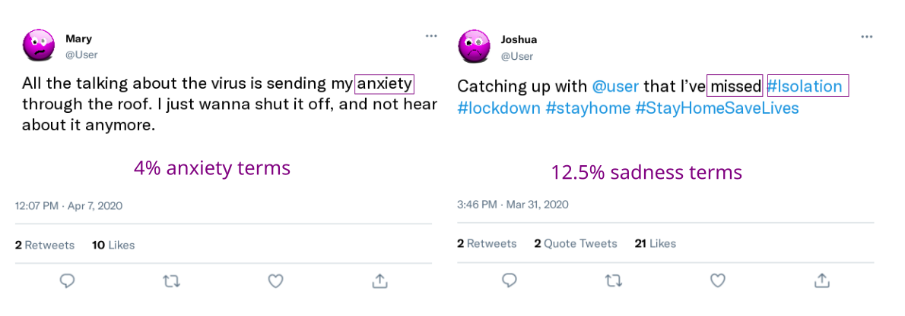
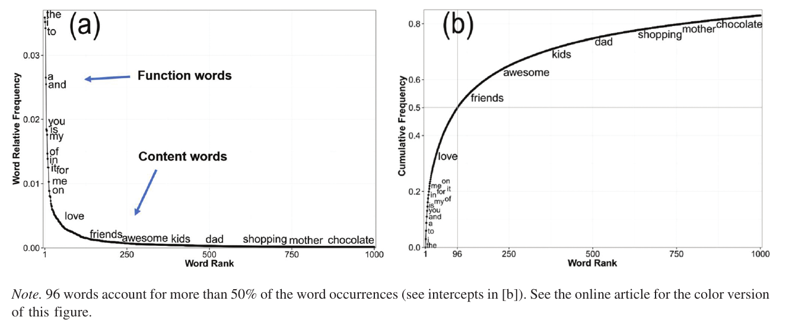
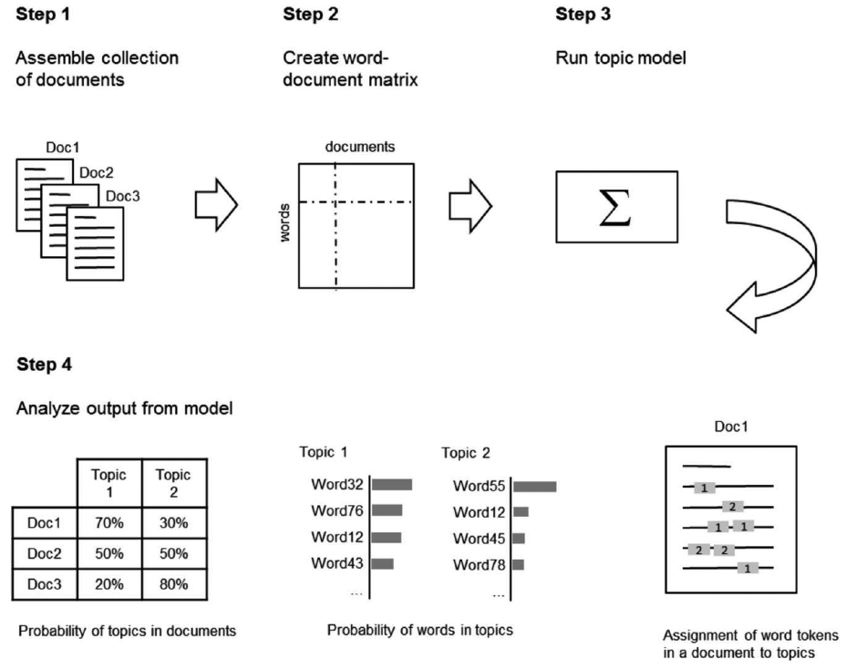
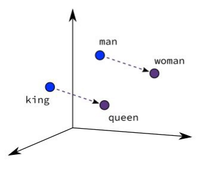

```{r xaringan-themer, include=FALSE, warning=FALSE}
# #This block contains the theme configuration for the CSS lab slides style
library(xaringanthemer) #
library(showtext)
style_mono_accent(
  base_color = "#1f5c99",
  text_font_size = "1.5rem",
  header_font_google = google_font("Raleway"),#("Yanone Kaffeesatz"),
  text_font_google   = google_font("Arial", "300", "300i"),
  code_font_google   = google_font("Fira Mono")
)
```

```{r setup, include=FALSE}
options(htmltools.dir.version = FALSE)
```

layout: true

---

## Overview

* [Paper link](https://static1.squarespace.com/static/53d29678e4b04e06965e9423/t/6189970b8180b9631ccdee10/1636407067876/2021psychMethods.pdf) <br><br>
* Closed-vocabulary (word lists) and open-vocabulary approaches (data-driven)
  * choice should depend on research questions and predictive power <br><br>
* Comparison on same dataset: MyPersonality dataset
    * Facebook status updates & self-reported survey data from 65,896 users
    * Prediction of gender/age, personality, tracing psychological processes <br><br>
* Open source language analysis tools
* Typical errors in closed vocabulary methods
* Impact of sample size, number of words per user, number of topics
* Recommendations for best practices

---

# Closed vocabulary approaches

* From social sciences
* Word lists (=dictionaries) based on theory/expert judgement
* Word counts and relative frequencies

```{r, echo=FALSE, out.width=1000}

```

---

# Closed vocabulary approaches

* Words are believed to theoretically represent the construct
    * Like items in questionnaires
    * Agency dictionary:  “authoritative,” “masterful,” “choice,” and “decide,” (Pietraszkiewicz et al.’s 2019)
    
* Generous number of synonyms and forms of words to capture differences in language use

* Many words occur rarely
  
    
---

# Statistical Fundamentals of Language Use

Relative frequency of 1000 most common words vs. their frequency rank
```{r, echo=FALSE, out.width=1000}

```

???
* Frequency in sentences vs. rank: not a linear relationship, but a Zipfian law
* Function words very frequent  (articles, pronouns, prepositions, and conjunctions)
* Many more content words, used less frequently
* b: 96 words account for 50%

---

# Function vs. content words

* Content words: Highly skewed, log-normal

* Function words: normal distribution

    * very frequent even in small samples 
    
    * better suited for standard statistical methods
    
    * more reliable markers of psychological processes
    * used without conscious attention (we don't keep track)
    
    * particularly useful in psych studies


---

## Common closed vocabulary programs

#### 1) The General Inquirer (GI): 182 dictionaries in total, 1960-2000

  * 8 Lasswell dictionaries: 
      * deference: power, rectitude, respect, affection, 
      * welfare wealth, well-being, enlightenment, skill
  
  * 107 Harvard psycho-sociological dictionaries (*Harvard IV*):  
      * e.g. virtues, feelings, overstatement, rituals, social, cognitive, motivation
  
  * Stanford political dictionaries for decision making in political interactions (*Osgood*)

---
  
## Common  closed vocabulary programs

#### 2) DICTION:  “verbal tone” in 500 U.S. presidential speeches 

* meaning of words specific to political and business contexts

#### 3) LIWC: Linguistic Inquiry and Word Count, 1993, 2001, **2007, 2015**

* Developed to analyze essays written during expressive writing intervention
* Hierarchical organisation (e.g. negative emotions)
* Function vs. content words (e.g. I and low status/depression)

#### 4) Dictionaries for narrow application in clinical context (see paper)


???
Clinical:  
  * Regressive Imagery Dictionary/Count 
  * TAS/C 
  * PCAD: /Psychiatric Content Analysis and Diagnosis 

---

## Open vocabulary approaches: Clustering

* From computer science: clusters of semantically related words
* Reduce the number of dimensions, better for prediction

#### 1) Latent Semantic Analysis (LSA): similarity between texts

* Dimensionality reduction (like factor analysis): 
    * Words in space of ~300 latent dimensions
* Semantic word similarity: cosine similarity of vectors = overlap of use contexts <br> <br>
* Dimensions hard to interpret
* Reason: ignores multiple word senses: “buckle”, “belt”, and “asteroid” 
* Math constraints don't represent language structure


---

## Common open vocabulary approaches

#### 2) Latent Dirichlet Allocation: Topic modelling

.pull-left[
* Co-occurrence of words
* Weights per word </br> =  contribution to topic
* More semantically coherent  
* Word senses separated per context: 
  * belt, asteroid, Jupiter
  * belt, buckle, pants
* Topic modelling vs. extraction
  * Modelling better with large set
]

.pull-right[

```{r, echo=FALSE, out.width=1000}

```
]

---

## Common open vocabulary approaches

#### 3) Word embeddings: vector representations

* Words that occur in similar contexts tend to have similar meanings
* Contexts (embeddings) describe words in low-dimensional vector space (300)

.pull-left[.center-left[
```{r, echo=FALSE, out.width=400}

```
]]

.pull-right[
Examples
* Word2Vec
* GloVe
]
---

#### 3) Word embeddings: vector representations

* Optimize vector to correctly predict which words are in the context 
    * typical: 3-6 words on each side as embeddings
    
* Ground truth: actually occurring words
* Can be learned/pretrained on massive datasets
  * Fixed vectors applied (*extracted*) in smaller datasets

* Captures human intuitions about which words are associated

* Input to supervised models (SVM, random forests,...) or deep learning

---

#### 4) Contextual word embeddings

* *Fixed* vectors: same list of numbers in every context when applied (*extracted*)

* *Contextual*: different vectors assigned based on the context
    * not only during pretraining, but also during extraction
    * “they played soccer” and “they went to the play.” 
    * computationally more intensive
    
* Have improved performance in nearly every task
  * ELMO (recurrent neural network)
  * BERT, XLNet, RoBERTa (transformer)

---
## Common open vocabulary approaches 

#### 5) Differential Language Analysis

* Correlation of word frequencies with traits

* Words that best represent a construct

  * e.g. personality traits, age, gender
  
* Pos/neg: words that differentiate an outcome

* Emoticons, punctuation, multiword expressions

* Exploratory method: many correlations with correction

---

# Comparison

.pull-left[.center-left[
**Open-vocabulary approaches**
* Easy to calculate many variables

* Comparable across studies
* rigid, insensitive to context &
* changes in meanings over time

* spurious correlations
]]

.pull-right[.center-right[
**Closed-vocabulary approaches: LDA**
* more technical expertise

* more computation & large datasets
* differentiate word senses

* semantically coherent
]]

---

## Existing validation studies

* Self report data as ground truth

* LIWC 2001/2007: cognitive mechanisms, attention, low social status <br> Tausczik and Pennebaker (2010) 
* LIWC2001: demographics, big 5, mental/physical health <br> (Pennebaker 2003)
* GI, DICTION, TAS/C (Mehl 2006) <br><br>
* Closed + open: lower-order personality facets (Yarkoni 2010)
* ML personality with facebook dataset: Schwartz et al. 2013
* Meta-analysis on big five studies (Azucar et al. 2018)


---

# Conclusion

* Social media data as opportunity

* We need to know what these measures actually capture


---

## Methods

* Relative word frequencies per user
* Emoticons, punctuation & most probably 2/3-grams included

* Dictionary extraction: Python code & MySQL infrastructure [(DLATK, Schwartz et al., 2017)]( http://dlatk.wwbp.org)
* LIWC 2015, DICTION, GI (Supplementary: LIWC 2007)

* Topic extraction per user: 2000 facebook topics from Schwartz et al. 2013

* Penalized regression: predict dictionaries & topics from gender, age, personality

* continue on p11 in paper

---

## Table 1: correlations between dictionaries

* overlap in words
* highest for function words, because these are most frequent

---

# Word clouds 

* Dictionaries:
  * Word clouds larger words indicate stronger correlations with the outcome 
  * Color: frequency

* Topics: 10 words with the largest prevalence in the topic
  * prevalence: size and color of word (dark/large = prevalent)

---


# Conclusions

* Recommendations for best practices: complementary use of both
    * how people think & feel: closed approaches
    * what people think & feel: open approaches

